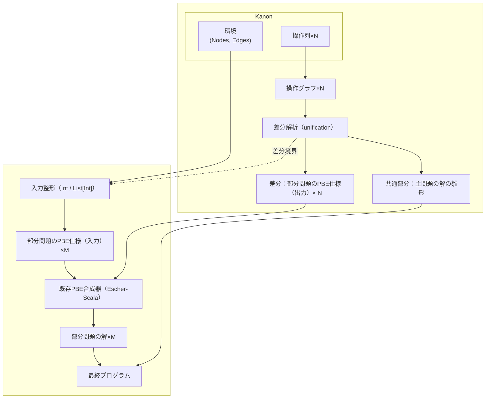

# Architecture Overview

RefSynは、Kanonの操作ログから主問題と部分問題を抽出し、既存のPBE合成器を用いて最終プログラムを構築する。現在の実装では環境中の値を`Int`や`List[Int]`として扱い、操作列はグラフとして解析される。



## フロー詳細
1. **入力取得**: Kanonから環境(グラフ情報、NodesやEdges)と操作列を仕様の個数分(N個の仕様記述があるならN個)だけ受け取る。
2. **操作表現**: 操作列を操作グラフとして表現する。
3. **差分解析**: 各仕様の操作グラフ(N個)のunificationにより共通部分と差異部分に分ける。(N個の仕様についてM種類の差異部分が出てくる)
4. **入力整形**: 1で受け取ったKanonの初期環境に、差異部分までの操作(操作列には順序がついているので確定する)を加えた環境をInt/List[Int]/List[Ptr]/Ptrで表現し、`__Variable-<name>` の参照先を引数（`Int`/`Ptr`）として扱う。
4. **部分問題合成**: 4で整形された環境を入力、3で得た差異部分のobjectのindexを出力として、入出力例による部分合成問題を既存の合成器(Escher-Scala)を使って解く。
5. **最終出力**: 得られた部分問題の解が何であるかを解釈し、共通部分から得られるプログラムの雛形と合わせて主問題の解を構成する。

このパイプラインにより、ユーザ操作から高水準なプログラムを合成できる。

## 共通部分の意味論と統合（設計メモ）

### 先に結論
- 現状の実装は「差分関数（`aux-f`, `aux-g`, ...）の合成と翻訳」までで止まっており、共通操作をJS文へ戻して差分解と統合する層が未実装。
- `SynthesisResponse.common_pattern` / `hole_information` は現状 `None` 固定。

### 操作の最小意味論（JS向け）
- `addNode(isLiteral=false, id, label)`:
  - 新規オブジェクトを作る。`label` がコンストラクタ名として有効なら `new <label>()`、不明なら `{}`。
- `addNode(isLiteral=true, id, label)`:
  - 値ノードを作る（JSでは即値として扱う）。
- `addEdge(from, to, field)`:
  - `from[field] = to` の代入。
- `ExistNode(id)`:
  - 既存オブジェクト参照（`this` か、差分ホール関数の返り値、または既知パス）。

### 統合アルゴリズム（実装候補）
1. `common_a` を「元の操作インデックス順」で再構築して `CommonPlan` を作る。
2. `diff_pairs` を `HolePlan`（`hole_k -> aux_name, return_type, args`）へ変換。
3. `CommonPlan` 上で、diffに属するノード参照を `hole_k` に置換する。
4. 共通操作を順にJS文へ射影:
   - ノード生成
   - フィールド代入
5. 先頭で `hole_k` を `aux_*` 呼び出しとして束縛し、共通文で利用する。
6. 最終的に `common_pattern`（テンプレート）と統合済み `code`（実JS）を返す。

### 実装状況（2026-02, stage 2）
- `common_pattern` には操作レベルの計画文字列（`COMMON_PLAN` / `HOLE_BINDINGS`）を返す。
- `hole_information` には `spec`, `return`, `jsMethod`, `jsCall`, `sideA`, `sideB`, `anchorA/B` を返す。
- `common` の順序は `op_<index>` で復元し、`unify_ops` 内部ソート順（Debug文字列順）は直接使わない。
- `method_calls[*].methodName` は同一値であることを前提とし、混在時は RefSyn が `400 Bad Request` を返す。
- `method_calls[*].methodParamNames` があれば本体メソッド署名に使用し、未指定時は `arg` / `arg0..` を補完する。
- 共通操作（`addNode`/`addEdge`）から `composed_method_code` を生成して返す（`addNode` は `const tmp*` 生成、`addEdge` は代入文に射影）。
- Kanon 側は `receiverObject` のノードラベルをクラス名ヒントとして利用し、`methodName + arity + class` で対象メソッド定義位置を選んで `composed_method_code` を置換する。
- 置換失敗時のフォールバック出力は editor を壊さないようコメント行で挿入する（無効JSを挿入しない）。
- `removeNode`/`removeEdge`/`deleteNode`/`deleteEdge` を含む payload は現状 `400 Bad Request` とする。

### append 例での期待形
```js
append(arg0) {
  const h_ptr_0 = this.append_f(arg0);
  const h_int_0 = this.append_g(arg0);
  const tmp0 = new Node();
  tmp0.val = h_int_0;
  h_ptr_0.next = tmp0;
}
```

### 注意点
- `unify_ops` 内で `common/diff` を `Debug` 文字列で sort しているため、実行順は必ず元の `op_<index>` から再構成すること。
- `removeNode/removeEdge` の意味論は `list_env` で未実装（no-op）なので、共通統合の対象はまず `addNode/addEdge` に限定するのが安全。

## 差分境界の環境エンコード方針（2026-02）

### 背景
- `append(26)` のように呼び出し時点で `this.next === null` なケースと、`append(10)` のように `this.next !== null` なケースを同時に扱うとき、差分境界の取り方を誤ると前者の情報が消える。
- `Json` 系 diff は操作インデックスを持つが、`ExistNode` はインデックスを持たないため、アンカー決定を誤ると `env_boundary`（共通適用後）に落ちて前提が後状態に潰れる。

### 推奨ポリシー
- 入力環境は「対象差分より前の prefix（exclusive）」を使う。
- 出力値の抽出は「対象差分を適用した後（inclusive）」を使う。
- つまり、各差分ケースで `env_in`（前状態）と `env_out`（後状態）を分離する。

### この方針の妥当性
- 差分が複数ある場合でも、`i` 番目の差分に対して `prefix(< i)` を使えば、先行差分の影響は保持できる。
- 一方で `prefix(<= i)` を入力に使うと、対象差分そのものの効果が入力に混ざり、仕様が自己充足的になりやすい。

### 実装上の注意
- `Json` 系 diff は操作インデックスを持つので `prefix` を機械的に取れる。
- `ExistNode` は「その object id が操作列で最初に参照される位置」をアンカーとして使う（`id/from/to` の最初の出現インデックス）。
- 両側 `ExistNode` で参照位置が取れないケースのみ `env_boundary` にフォールバックする。
- 新規生成ノードを `Ptr` 出力で返すケースは、現在の入力表現（入力側の `List[Ptr]` インデックス体系）では表現力に制約がある。

## 再帰合成の限界（現状）
- 2例だけでは、再帰 (`this.next.aux_g(arg0)`) と深さ固定の条件分岐を識別できない。
- 再帰を狙う場合は、深さの異なる追加例（少なくとも 3 段階以上）と、再帰を優先する文法バイアス/テンプレートが必要。

## Escherブリッジ（tests.json 生成）
- 実装: `src/escher_bridge.rs`
- 機能:
  - 動的フィールド検出（値/ポインタ）: 特定のフィールド名をハードコーディングしない
  - 変数ノード（`__Variable-this` を優先、なければ `__Variable-<name>`）からルートを検出し、ポインタフィールドに沿ってBFSでローカルインデックスを構築
  - nullPtr は JSON `null`、`Int` の欠損は `-1` で正規化
  - `input` は `[引数..., vs_*..., ns_*...]`（引数は `this` を先頭にし、残りは変数名の昇順）
  - `inputTypes` は最初のケースから `arg_types + List[Int]/List[Ptr]` を生成

### 使用例（概要）
```
use refsyn::escher_bridge::{EscherCase, build_escher_spec, specs_to_json, write_spec_to_file};

let spec = build_escher_spec(
    "append-g",
    "Int",
    &[EscherCase {
        env,
        vis_graph,
        arguments: vec![json!(0)],
        arg_types: Some(vec!["Ptr".to_string()]),
        receiver_arg_index: Some(0),
        output: json!(2),
    }]
)?;
let specs = vec![spec];
let json_text = specs_to_json(&specs)?;
write_spec_to_file("Escher-Scala/src/main/resources/escher/tests.json", &json_text)?;
```
