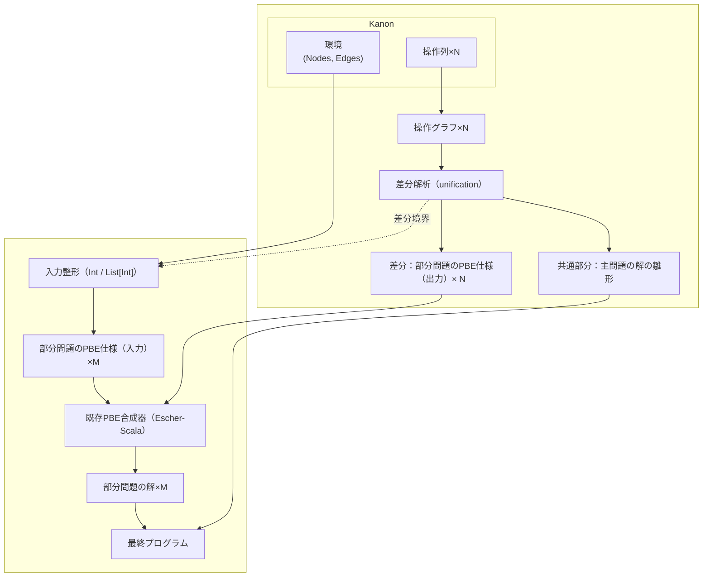

# Architecture Overview

RefSynは、Kanonの操作ログから主問題と部分問題を抽出し、既存のPBE合成器を用いて最終プログラムを構築する。現在の実装では環境中の値を`Int`や`List[Int]`として扱い、操作列はグラフとして解析される。



## フロー詳細
1. **入力取得**: Kanonから環境(グラフ情報、NodesやEdges)と操作列を仕様の個数分(N個の仕様記述があるならN個)だけ受け取る。
2. **操作表現**: 操作列を操作グラフとして表現する。
3. **差分解析**: 各仕様の操作グラフ(N個)のunificationにより共通部分と差異部分に分ける。(N個の仕様についてM種類の差異部分が出てくる)
4. **入力整形**: 1で受け取ったKanonの初期環境に、差異部分までの操作(操作列には順序がついているので確定する)を加えた環境をInt/List[Int]/List[Ptr]/Ptrで表現し、`__Variable-<name>` の参照先を引数（`Int`/`Ptr`）として扱う。
4. **部分問題合成**: 4で整形された環境を入力、3で得た差異部分のobjectのindexを出力として、入出力例による部分合成問題を既存の合成器(Escher-Scala)を使って解く。
5. **最終出力**: 得られた部分問題の解が何であるかを解釈し、共通部分から得られるプログラムの雛形と合わせて主問題の解を構成する。

このパイプラインにより、ユーザ操作から高水準なプログラムを合成できる。

## Escherブリッジ（tests.json 生成）
- 実装: `src/escher_bridge.rs`
- 機能:
  - 動的フィールド検出（値/ポインタ）: 特定のフィールド名をハードコーディングしない
  - 変数ノード（`__Variable-this` を優先、なければ `__Variable-<name>`）からルートを検出し、ポインタフィールドに沿ってBFSでローカルインデックスを構築
  - nullPtr は JSON `null`、`Int` の欠損は `-1` で正規化
  - `input` は `[引数..., vs_*..., ns_*...]`（引数は `this` を先頭にし、残りは変数名の昇順）
  - `inputTypes` は最初のケースから `arg_types + List[Int]/List[Ptr]` を生成

### 使用例（概要）
```
use refsyn::escher_bridge::{EscherCase, build_escher_spec, specs_to_json, write_spec_to_file};

let spec = build_escher_spec(
    "append-g",
    "Int",
    &[EscherCase {
        env,
        vis_graph,
        arguments: vec![json!(0)],
        arg_types: Some(vec!["Ptr".to_string()]),
        receiver_arg_index: Some(0),
        output: json!(2),
    }]
)?;
let specs = vec![spec];
let json_text = specs_to_json(&specs)?;
write_spec_to_file("Escher-Scala/src/main/resources/escher/tests.json", &json_text)?;
```
