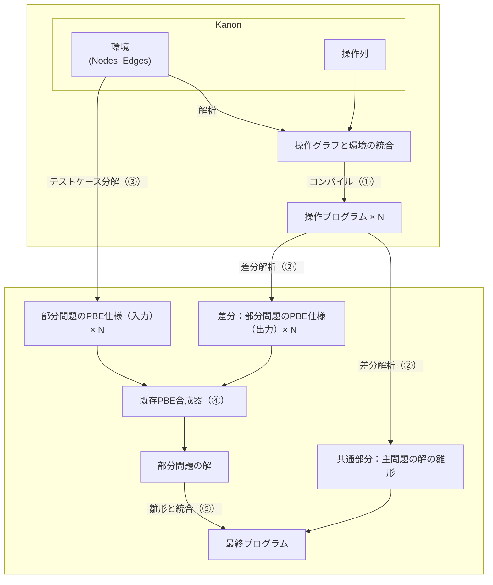

# Architecture Overview

RefSynは、Kanonの操作ログから主問題と部分問題を抽出し、既存のPBE合成器を用いて最終プログラムを構築する。現在の実装では環境中の値を`Int`や`List[Int]`として扱い、操作列はグラフとして解析される。

## フロー詳細
1. **入力取得**: Kanonから環境(グラフ情報、NodesやEdges)と操作列を受け取る。
2. **操作表現**: 操作列を操作グラフとして表現する。
3. **差分解析**: 各仕様の操作グラフのinificationにより共通部分と差異部分に分ける。
4. **入力整形**: Kanonの初期環境に差異部分までの操作を加えた環境をIntまたはList[Int]で表現する。
4. **部分問題合成**: 整形された環境を入力、差異部分を出力として、部分合成問題を既存の合成器(Escher-Scala)を使って解く。
5. **最終出力**: 得られた部分問題の解が何であるかを解釈し、共通部分から得られるプログラムの雛形と合わせて主問題の解を構成する。

このパイプラインにより、ユーザ操作から高水準なプログラムを合成できる。
