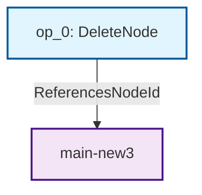
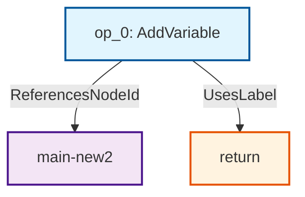
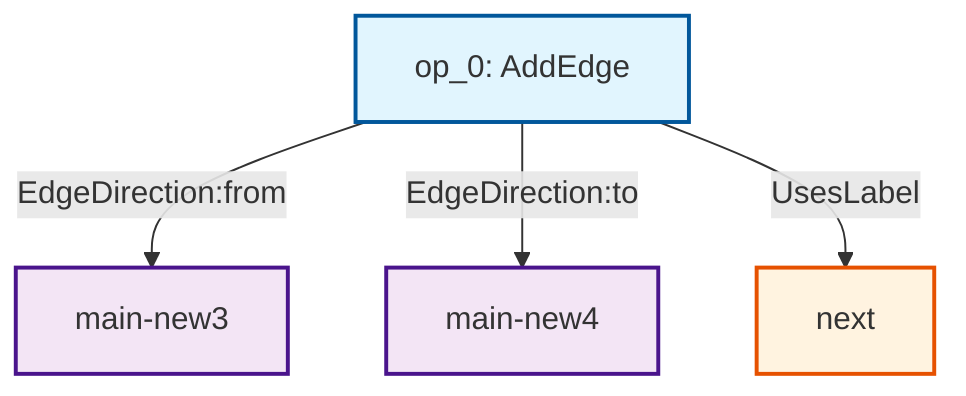
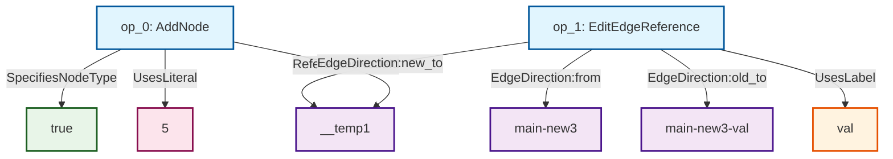

# 共通部分抽出アルゴリズム

RefSyn は複数のオブジェクト操作列から "最大部分被覆" を求め，差異をホールとして残したテンプレートプログラムを生成する。
ここでは実装の流れを自然言語と擬似コードを交えて説明する。

## アルゴリズム概要

1. **操作ログの変換** - KanonからのJSONログをIR（中間表現）に変換
2. **依存関係分析** - 操作間の依存関係を分析し、有向グラフを構築
3. **正規化** - トポロジカルソートにより操作順序を正規化
4. **パターンマッチング** - 複数の操作列をマッチングして共通パターンを抽出
   - **線形マッチング**: 順序に基づく直接比較
   - **構造的同型マッチング**: 依存関係グラフの同型性に基づく比較
   - **詳細構造マッチング**: 操作の内部構造を明示化した詳細グラフによる比較
5. **ホール抽出** - 差異をホール（穴）として識別
6. **ASTテンプレート生成** - ホールを含むテンプレートコードを生成

## 詳細アルゴリズム

### 1. 操作の中間表現（IR）

#### 操作の種類（OpKind）
```rust
pub enum OpKind {
    // ノード操作
    AddNode { id: NodeId, is_literal: bool, label: String },
    EditNode { id: NodeId, is_literal: bool, label: String },
    DeleteNode { id: NodeId },
    
    // エッジ操作
    AddEdge { from: NodeId, to: NodeId, label: String },
    EditEdgeReference { from: NodeId, old_to: NodeId, new_to: NodeId, label: String },
    EditEdgeLabel { from: NodeId, to: NodeId, old_label: String, new_label: String },
    DeleteEdge { from: NodeId, to: NodeId, label: String },
    
    // 変数操作
    AddVariable { to: NodeId, label: String },
    EditVariableReference { old_to: NodeId, new_to: NodeId, label: String },
    EditVariableLabel { to: OpId, old_label: String, new_label: String },
    DeleteVariable { to: OpId, label: String }
}
```

### 2. 依存関係分析

#### build_graph関数
```
入力: 操作列 ops: &[Op]
出力: (依存グラフ, ノードインデックスマップ)

for 各操作 u in ops:
    for 各後続操作 v in ops[u+1..]:
        if u と v に依存関係がある:
            グラフに辺を追加 (u → v)
```
#### 依存関係判定ルール
1. `AddNode → 任意の操作`: 後続操作がそのNodeIDを参照する場合
2. `AddEdge → AddEdge`: 同じfromとlabelを持つ場合
3. `AddEdge → EditEdgeReference`: 同じfromとlabelを持つ場合
4. `EditEdgeReference → EditEdgeReference`: 同じfromとlabelを持つ場合
5. `AddVariable → AddVariable`: 同じlabelを持つ場合
6. `AddVariable → EditVariableReference`: 同じlabelを持つ場合
7. `EditVariableReference → EditVariableReference`: 同じlabelを持つ場合

### 3. 正規化（トポロジカルソート）

#### canonical_order関数
```
入力: 操作列 ops: &[Op]
出力: 正規化された操作ID順序

1. 依存グラフを構築
2. 各ノードの入次数を計算
3. 優先度付きキューを初期化（入次数0のノードを追加）
4. Kahnのアルゴリズム実行：
   while キューが空でない:
       最高優先度のノードを取り出し
       結果リストに追加
       隣接ノードの入次数を減らし
       入次数0になったノードをキューに追加
```

#### 操作優先度
```rust
fn get_label_priority(op: &Op) -> (i32, &str) {
    match &op.kind {
        OpKind::AddNode { .. } => (0, ""),        // 最高優先度
        OpKind::AddEdge { .. } => (1, ""),
        OpKind::EditEdgeReference { .. } => (1, ""),
        OpKind::AddVariable { .. } => (2, ""),
        OpKind::EditVariableReference { .. } => (2, ""),
        _ => (3, ""),                             // 最低優先度
    }
}
```

### 4. パターンマッチング

#### match_graphs関数（線形比較）
```
入力: 2つの操作列 a, b
出力: MatchResult { common_ops, holes }

1. 両方の操作列を正規化
2. 同じ位置の操作を比較:
   for i in 0..min(a.len(), b.len()):
       if 操作種類が同じ:
           詳細比較を実行
           差異をホールとして記録
           共通操作として追加
```

#### match_graphs_with_isomorphism関数（構造的同型比較）
```
入力: 2つの操作列 a, b
出力: Option<MatchResult { common_ops, holes }>

1. 両方の操作列を正規化
2. 依存グラフを構築:
   graph_a = build_graph(a)
   graph_b = build_graph(b)
   
3. ノード間のIDマッピングを作成:
   id_mapping = build_id_mapping_between_graphs(a, b)
   
4. グラフ同型判定:
   if is_isomorphic(graph_a, graph_b, id_mapping):
       同型と判定され、詳細比較を実行
       差異をホールとして記録
       return Some(MatchResult)
   else:
       return None  // 非同型のため比較不可
```

**構造的同型判定の詳細**:

##### build_id_mapping_between_graphs関数
```
入力: 操作列 a, b
出力: IDマッピング HashMap<NodeId, NodeId>

id_mapping = empty_map()

// 1. "this" と "main-new" の特別マッピング
id_mapping.insert("this", "this")
if both contain "main-new":
    id_mapping.insert("main-new", "main-new")

// 2. AddNode操作による双方向マッピング
for op_a in a:
    if op_a is AddNode:
        for op_b in b:
            if op_b is AddNode and 
               op_a.is_literal == op_b.is_literal and
               op_a.label == op_b.label:
                // 可能な組み合わせをマッピング候補に追加
                candidate_mappings.push((op_a.id, op_b.id))

// 3. 最適なマッピングを選択（貪欲法）
// 構造的同等性を最大化するマッピングを選択
```

##### is_isomorphic関数
```
入力: graph_a, graph_b, id_mapping
出力: bool

// 1. ノード数チェック
if graph_a.node_count() != graph_b.node_count():
    return false

// 2. エッジ数チェック  
if graph_a.edge_count() != graph_b.edge_count():
    return false

// 3. ノード互換性チェック
for node_a in graph_a.nodes():
    if let Some(node_b) = id_mapping.get(node_a):
        if !are_nodes_compatible(node_a, node_b, a_ops, b_ops):
            return false

// 4. エッジ互換性チェック
for edge_a in graph_a.edges():
    mapped_from = id_mapping.get(edge_a.from)
    mapped_to = id_mapping.get(edge_a.to)
    
    if !graph_b.has_edge(mapped_from, mapped_to):
        return false
        
    if !are_edges_compatible(edge_a, corresponding_edge_b):
        return false

return true
```

##### are_nodes_compatible関数（ノード互換性判定）
```
入力: node_a, node_b, 操作列 a, b
出力: bool

op_a = find_add_node_operation(node_a, a)
op_b = find_add_node_operation(node_b, b)

// 1. リテラル性の一致
if op_a.is_literal != op_b.is_literal:
    return false

// 2. ラベル一致判定（柔軟性有り）
// 現在の実装では厳密一致を要求
if op_a.label != op_b.label:
    return false

// 【提案】構造的マッチングの場合：
// - 操作タイプ（メソッド呼び出し、プロパティアクセス等）で判定
// - ラベルの完全一致は不要（差異はホールとして抽出）

return true
```

**同型検出の利点**:
- **構造的同等性**: 操作の順序に依存しない比較
- **柔軟なマッチング**: 依存関係が保持されていれば異なる順序でもマッチ
- **高精度**: 構造的に異なるパターンの誤マッチを防止

**計算量**:
- グラフ構築: O(n²) (n = 操作数)
- 同型判定: O(V + E) (V = ノード数, E = エッジ数)
- 全体的に線形比較より高コストだが、精度向上と引き換え

#### match_graphs_with_flexible_structure関数（詳細構造マッチング）
```
入力: 2つの操作列 a, b
出力: bool

1. 詳細構造グラフを構築:
   graph_a = build_detailed_structure_graph(a)
   graph_b = build_detailed_structure_graph(b)
   
2. 柔軟な同型判定:
   is_isomorphic_matching(graph_a, graph_b, node_matcher, edge_matcher)
```

**詳細構造グラフの特徴**:

##### build_detailed_structure_graph関数
```
入力: 操作列 ops: &[Op]
出力: (詳細グラフ, ノードインデックスマップ)

// 1. 各操作をOperationノードとして追加
for op in ops:
    graph.add_node(DetailedNode::Operation(op.id))

// 2. 操作の詳細要素をノードとして追加し、エッジで接続
for op in ops:
    match op.kind:
        AddNode { id, is_literal, label }:
            // ノードIDを追加
            node_id_node = DetailedNode::NodeId(id)
            graph.add_edge(op_node, node_id_node, DetailedEdge::ReferencesNodeId)
            
            // ノードタイプを追加
            type_node = DetailedNode::NodeType(is_literal)
            graph.add_edge(op_node, type_node, DetailedEdge::SpecifiesNodeType)
            
            // ラベル/リテラル値を追加
            if is_literal:
                literal_node = DetailedNode::Literal(label)
                graph.add_edge(op_node, literal_node, DetailedEdge::UsesLiteral)
            else:
                label_node = DetailedNode::Label(label)
                graph.add_edge(op_node, label_node, DetailedEdge::UsesLabel)
                
        AddEdge { from, to, label }:
            // from/toノードIDを方向性エッジで接続
            from_node = DetailedNode::NodeId(from)
            graph.add_edge(op_node, from_node, DetailedEdge::EdgeDirection("from"))
            
            to_node = DetailedNode::NodeId(to)
            graph.add_edge(op_node, to_node, DetailedEdge::EdgeDirection("to"))
            
            label_node = DetailedNode::Label(label)
            graph.add_edge(op_node, label_node, DetailedEdge::UsesLabel)
```

##### 詳細ノード種別
```rust
pub enum DetailedNode {
    Operation(OpId),           // 操作自体
    NodeId(String),           // ノードID（__temp1, main-new1等）
    Literal(String),          // リテラル値（"0", "hello"等）
    Label(String),            // ラベル（"val", "next"等）
    NodeType(bool),          // ノードタイプ（true=literal, false=object）
}
```

##### 詳細エッジ種別
```rust
pub enum DetailedEdge {
    ReferencesNodeId,         // 操作がノードIDを参照
    UsesLabel,               // 操作がラベルを使用
    UsesLiteral,            // 操作がリテラル値を使用
    SpecifiesNodeType,      // 操作がノードタイプを指定
    EdgeDirection(String),   // エッジの方向性（"from", "to", "old_to", "new_to"）
}
```

##### 柔軟な同型マッチング
```rust
node_matcher = |node_a, node_b| {
    match (node_a, node_b) {
        // 操作ノード同士は常にマッチ（種類は接続ノードで判定）
        (DetailedNode::Operation(_), DetailedNode::Operation(_)) => true,
        
        // ノードIDは異なっていても良い（ホールとして扱う）
        (DetailedNode::NodeId(_), DetailedNode::NodeId(_)) => true,
        
        // リテラル値は異なっていても良い（ホールとして扱う）
        (DetailedNode::Literal(_), DetailedNode::Literal(_)) => true,
        
        // ラベルとノードタイプは一致が必要（構造の重要な部分）
        (DetailedNode::Label(a), DetailedNode::Label(b)) => a == b,
        (DetailedNode::NodeType(a), DetailedNode::NodeType(b)) => a == b,
        
        _ => false  // 異なる種類のノードはマッチしない
    }
};

edge_matcher = |edge_a, edge_b| {
    edge_a == edge_b  // エッジ種類は完全一致が必要
};
```

**詳細構造マッチングの利点**:
- **細粒度分析**: 操作の内部構造（使用するID、リテラル値、ラベル）を明示的に比較
- **ホール対応**: 具体的な値（ノードID、リテラル値）の差異を許容しつつ構造的類似性を判定
- **関係性保持**: 同じノードIDが複数の操作で使用される関係性を正確に捉える
- **精密マッチング**: 従来の依存関係グラフでは見落とされる細かな構造的差異を検出

**使用例**:
```javascript
// 例1: append操作
ops_a = [
    AddNode("__temp1", false, "Node"),
    AddNode("__temp2", true, "0"),        // リテラル値 "0"
    AddEdge("__temp1", "__temp2", "val"),
    AddEdge("main-new1", "__temp1", "next")
]

ops_b = [
    AddNode("__temp3", true, "3"),        // リテラル値 "3"（異なる）
    AddNode("__temp4", false, "Node"),
    AddEdge("__temp1", "__temp4", "next"),
    AddEdge("__temp4", "__temp3", "val")
]

// 詳細構造マッチング: true
// - 同じ操作パターン（AddNode×2, AddEdge×2）
// - 同じラベル使用（"Node", "val", "next"）
// - 同じノードタイプ（literal, object）
// - リテラル値（"0" vs "3"）とノードID差異は許容
```

**計算量**:
- 詳細グラフ構築: O(n) (n = 操作数)
- 同型判定: O(V + E) (V = 詳細ノード数, E = 詳細エッジ数)
- メモリ使用量: 従来の依存グラフより多い（操作の詳細要素を明示的にノード化）

#### 操作比較ルール

**AddNode比較**:
- `is_literal`が一致する場合のみマッチ
- `label`が異なる場合はConstホールを作成

**AddEdge比較**:
- `label`が一致する場合のみマッチ
- `from`, `to`が構造的に異なる場合はRefホールを作成

**EditEdgeReference比較**:
- `label`が一致する場合のみマッチ
- `from`, `old_to`, `new_to`それぞれについて構造的差異をチェック

### 5. ホール抽出

#### ホールの種類
```rust
pub enum Hole {
    Const { placeholder: String, values: Vec<String> },  // 定数の差異
    Ref { placeholder: String, refs: Vec<String> },      // 参照の差異
}
```

#### 構造的同等性判定
```rust
fn is_structurally_equivalent(id_a, id_b, a_ops, b_ops, id_mapping) -> bool {
    // 1. 同じIDの場合は同等
    // 2. main-new（既存）と__temp（新規）は異なるものとして扱う
    // 3. IDマッピングで対応している場合は同等
    // 4. AddNode操作を検索し、is_literalとlabelが一致すれば構造的に同等
}
```

### 6. テンプレートAST生成

#### generate_template_ast関数
```
入力: MultiMatchResult, MemoEnv
出力: テンプレートProgram

1. ID正規化:
   - 決定論的順序でIDをソート
   - obj_0, obj_1, ... のように変数名を割り当て
   - "this"や"main-new"は特別扱い

2. ホール番号正規化:
   - Hole1, Hole2, ... のように連番を割り当て

3. AST文生成:
   for 各共通パターン操作:
       match 操作種類:
           AddNode → VarDecl文
           AddEdge → Assign文
           EditEdgeReference → Assign文
           AddVariable → VarDecl文
```

#### ID → AST式変換
```rust
fn get_normalized_expr_for_id_with_mapping_and_holes(id, id_mapping, holes, ...) -> Expr {
    // 1. ホールに含まれるかチェック
    // 2. 定数ホールの場合はHole式を返す
    // 3. 参照ホールの場合は通常の変数マッピングを使用
    // 4. "this"や"main-new"の特別処理
    // 5. デフォルト変数名の生成
}
```

### 7. メイン処理フロー

#### find_common_pattern_from_operations関数
```
入力: operations_list, memo_envs
出力: (Option<Program>, HashMap<String, Vec<String>>)

1. 各操作ログをIRに変換
2. 各操作列をトポロジカルソート
3. 複数操作列のマッチング:
   if 2つ以上の操作列:
       パターンマッチングを実行
       テンプレートASTを生成
       ホール情報を抽出
   else:
       単一操作列からASTを生成
```

## アルゴリズムの特徴

### 依存関係を考慮した正規化
- 操作間の依存関係を明示的にモデル化
- トポロジカルソートにより実行可能な順序を保証
- 優先度により決定論的な順序を実現

### 構造的マッチング
- 操作の種類だけでなく、構造的な同等性を判定
- IDの意味（既存オブジェクト vs 新規オブジェクト）を考慮
- 柔軟なホール抽出により汎用的なパターンを生成

### ホール番号の正規化
- 一貫したホール識別子（Hole1, Hole2, ...）
- 定数ホールと参照ホールの区別
- テンプレート内での適切なホール配置

このアルゴリズムにより、複数のプログラム実行トレースから共通パターンを抽出し、差異をホールとして抽象化したテンプレートコードを生成できます。

## アルゴリズムの改良提案

### 3段階のマッチング戦略

現在の実装では複数のマッチング手法を提供しており、研究目的に応じて最適な戦略を選択できます：

#### 1. 線形マッチング（Linear Matching）
```rust
// match_graphs関数での順序ベース比較
fn linear_matching(a: &[Op], b: &[Op]) -> MatchResult {
    // 正規化後の順序で直接比較
    for i in 0..min(a.len(), b.len()) {
        if operations_compatible(a[i], b[i]) {
            // 共通操作として記録
        }
    }
}
```
**利点**: 計算コストが最も低い、実装が簡単
**欠点**: 順序の違いに敏感、柔軟性に欠ける

#### 2. 構造的同型マッチング（Structural Isomorphism）
```rust
// match_graphs_with_isomorphism関数での依存関係グラフ比較
fn structural_isomorphism(a: &[Op], b: &[Op]) -> bool {
    let (graph_a, _) = build_graph(a);
    let (graph_b, _) = build_graph(b);
    
    is_isomorphic_matching(graph_a, graph_b, node_matcher, edge_matcher)
}
```
**利点**: 操作順序に依存しない、依存関係を考慮
**欠点**: 操作の内部構造（使用するID等）の詳細は考慮しない

#### 3. 詳細構造マッチング（Detailed Structure Matching）【新実装】
```rust
// match_graphs_with_flexible_structure関数での詳細構造グラフ比較
fn detailed_structure_matching(a: &[Op], b: &[Op]) -> bool {
    let (graph_a, _) = build_detailed_structure_graph(a);
    let (graph_b, _) = build_detailed_structure_graph(b);
    
    is_isomorphic_matching(graph_a, graph_b, flexible_node_matcher, edge_matcher)
}
```
**利点**: 操作の内部構造を明示化、ホール抽出に最適、関係性を正確に捉える
**欠点**: 計算コストとメモリ使用量が最も高い

### マッチング手法の比較

| 手法 | 計算量 | メモリ | 順序依存 | 内部構造 | ホール精度 | 適用場面 |
|------|--------|--------|----------|----------|------------|----------|
| 線形 | O(n) | 最小 | 有り | 無し | 低 | 高速プロトタイプ |
| 構造的同型 | O(n²) | 中 | 無し | 部分的 | 中 | 一般的な用途 |
| 詳細構造 | O(n) | 高 | 無し | 完全 | 高 | 精密解析 |

### 柔軟性の段階

#### 1. 厳密マッチング（Exact Matching）
```rust
fn strict_node_matcher(node_a, node_b) -> bool {
    node_a == node_b  // 完全一致
}
```

#### 2. 意味的マッチング（Semantic Matching）
```rust
fn semantic_node_matcher(node_a, node_b) -> bool {
    match (node_a, node_b) {
        (DetailedNode::Label(a), DetailedNode::Label(b)) => a == b,  // ラベルは一致
        (DetailedNode::NodeType(a), DetailedNode::NodeType(b)) => a == b,  // タイプは一致
        (DetailedNode::NodeId(_), DetailedNode::NodeId(_)) => true,  // IDは柔軟
        (DetailedNode::Literal(_), DetailedNode::Literal(_)) => true,  // 値は柔軟
        _ => false
    }
}
```

#### 3. 構造的マッチング（Structural Matching）【現在の詳細構造実装】
```rust
fn flexible_node_matcher(node_a, node_b) -> bool {
    // 操作種類のみで判定、具体的な値は全てホールとして扱う
    std::mem::discriminant(node_a) == std::mem::discriminant(node_b)
}
```

### パフォーマンス最適化

#### グラフ同型判定の高速化
1. **事前フィルタリング**: ノード数・エッジ数の事前チェック
2. **次数分布比較**: 各ノードの入次数・出次数分布の一致確認
3. **ラベル頻度分析**: ラベルの出現頻度による早期枝刈り

```rust
fn quick_isomorphism_check(graph_a, graph_b) -> bool {
    // 1. 基本統計チェック
    if graph_a.node_count() != graph_b.node_count() ||
       graph_a.edge_count() != graph_b.edge_count() {
        return false;
    }
    
    // 2. 次数分布チェック
    let degree_dist_a = compute_degree_distribution(graph_a);
    let degree_dist_b = compute_degree_distribution(graph_b);
    if degree_dist_a != degree_dist_b {
        return false;
    }
    
    // 3. ラベル頻度チェック
    let label_freq_a = compute_label_frequencies(graph_a);
    let label_freq_b = compute_label_frequencies(graph_b);
    if label_freq_a != label_freq_b {
        return false;
    }
    
    true  // 詳細チェックへ進む
}
```

### 適用場面の使い分け

- **高速プロトタイピング**: 線形マッチングで基本的なパターン発見
- **一般的な解析**: 構造的同型マッチングで順序に依存しないパターン抽出
- **精密なホール抽出**: 詳細構造マッチングで正確な差異分析
- **リファクタリング支援**: 意味的マッチングで関連する操作グループ抽出
- **厳密検証**: 厳密マッチングで完全一致パターンの特定

この多段階アプローチにより、研究目的や解析対象に応じて最適なマッチング戦略を選択でき、計算コストと精度のトレードオフを調整できます。

### 実装における優先順位

RefSynでは以下の優先順位でマッチング手法を適用します：

1. **詳細構造マッチング**: 最も精密な解析が可能
2. **構造的同型マッチング**: バランスの取れた手法
3. **線形マッチング**: フォールバック手法

これにより、可能な限り高精度な結果を提供しつつ、計算不可能な場合にも対応できる柔軟なシステムを実現しています。

## 詳細構造グラフの具体例

以下は、`append_ops_original`と`append_ops_b`操作列から構築される詳細構造グラフの例です。

### 操作列A (append_ops_original)

```rust
vec![
    Op { id: "op_0", kind: AddNode { id: "__temp1", is_literal: false, label: "Node" } },
    Op { id: "op_1", kind: AddNode { id: "__temp2", is_literal: true, label: "0" } },
    Op { id: "op_2", kind: AddEdge { from: "__temp1", to: "__temp2", label: "val" } },
    Op { id: "op_3", kind: AddEdge { from: "main-new1", to: "__temp1", label: "next" } },
]
```

### 詳細構造グラフA

```mermaid
graph TD
    %% Operations
    Op0[op_0: AddNode]:::operation
    Op1[op_1: AddNode]:::operation
    Op2[op_2: AddEdge]:::operation
    Op3[op_3: AddEdge]:::operation
    
    %% Node IDs
    NodeId1[__temp1]:::nodeId
    NodeId2[__temp2]:::nodeId
    NodeId3[main-new1]:::nodeId
    
    %% Node Types
    Type1[false]:::nodeType
    Type2[true]:::nodeType
    
    %% Labels and Literals
    Label1[Node]:::label
    Literal1[0]:::literal
    Label2[val]:::label
    Label3[next]:::label
    
    %% op_0 connections
    Op0 -->|ReferencesNodeId| NodeId1
    Op0 -->|SpecifiesNodeType| Type1
    Op0 -->|UsesLabel| Label1
    
    %% op_1 connections
    Op1 -->|ReferencesNodeId| NodeId2
    Op1 -->|SpecifiesNodeType| Type2
    Op1 -->|UsesLiteral| Literal1
    
    %% op_2 connections
    Op2 -->|EdgeDirection:from| NodeId1
    Op2 -->|EdgeDirection:to| NodeId2
    Op2 -->|UsesLabel| Label2
    
    %% op_3 connections
    Op3 -->|EdgeDirection:from| NodeId3
    Op3 -->|EdgeDirection:to| NodeId1
    Op3 -->|UsesLabel| Label3
    
    %% Styling
    classDef operation fill:#e1f5fe,stroke:#01579b,stroke-width:2px
    classDef nodeId fill:#f3e5f5,stroke:#4a148c,stroke-width:2px
    classDef nodeType fill:#e8f5e8,stroke:#1b5e20,stroke-width:2px
    classDef label fill:#fff3e0,stroke:#e65100,stroke-width:2px
    classDef literal fill:#fce4ec,stroke:#880e4f,stroke-width:2px
```



### 操作列B (append_ops_b)

```rust
vec![
    Op { id: "op_0", kind: AddNode { id: "__temp3", is_literal: true, label: "3" } },
    Op { id: "op_1", kind: AddNode { id: "__temp4", is_literal: false, label: "Node" } },
    Op { id: "op_2", kind: AddEdge { from: "__temp1", to: "__temp4", label: "next" } },
    Op { id: "op_3", kind: AddEdge { from: "__temp4", to: "__temp3", label: "val" } },
]
```

### 詳細構造グラフB

```mermaid
graph TD
    %% Operations
    Op0B[op_0: AddNode]:::operation
    Op1B[op_1: AddNode]:::operation
    Op2B[op_2: AddEdge]:::operation
    Op3B[op_3: AddEdge]:::operation
    
    %% Node IDs
    NodeId1B[__temp3]:::nodeId
    NodeId2B[__temp4]:::nodeId
    NodeId3B[__temp1]:::nodeId
    
    %% Node Types
    Type1B[true]:::nodeType
    Type2B[false]:::nodeType
    
    %% Labels and Literals
    Literal1B[3]:::literal
    Label1B[Node]:::label
    Label2B[next]:::label
    Label3B[val]:::label
    
    %% op_0 connections
    Op0B -->|ReferencesNodeId| NodeId1B
    Op0B -->|SpecifiesNodeType| Type1B
    Op0B -->|UsesLiteral| Literal1B
    
    %% op_1 connections
    Op1B -->|ReferencesNodeId| NodeId2B
    Op1B -->|SpecifiesNodeType| Type2B
    Op1B -->|UsesLabel| Label1B
    
    %% op_2 connections
    Op2B -->|EdgeDirection:from| NodeId3B
    Op2B -->|EdgeDirection:to| NodeId2B
    Op2B -->|UsesLabel| Label2B
    
    %% op_3 connections
    Op3B -->|EdgeDirection:from| NodeId2B
    Op3B -->|EdgeDirection:to| NodeId1B
    Op3B -->|UsesLabel| Label3B
    
    %% Styling
    classDef operation fill:#e1f5fe,stroke:#01579b,stroke-width:2px
    classDef nodeId fill:#f3e5f5,stroke:#4a148c,stroke-width:2px
    classDef nodeType fill:#e8f5e8,stroke:#1b5e20,stroke-width:2px
    classDef label fill:#fff3e0,stroke:#e65100,stroke-width:2px
    classDef literal fill:#fce4ec,stroke:#880e4f,stroke-width:2px
```


### 柔軟な構造マッチングによる対応関係

`match_graphs_with_flexible_structure`による同型判定では、以下の対応関係が確立されます：

#### ノード対応表

| グラフA | グラフB | ノード種別 | マッチング理由 |
|---------|---------|------------|----------------|
| op_0 | op_1 | Operation | 両方ともAddNode操作 |
| op_1 | op_0 | Operation | 両方ともAddNode操作 |
| op_2 | op_3 | Operation | 両方ともAddEdge操作 |
| op_3 | op_2 | Operation | 両方ともAddEdge操作 |
| __temp1 | __temp4 | NodeId | ホールとして扱い（値は異なるが構造的役割は同じ） |
| __temp2 | __temp3 | NodeId | ホールとして扱い（値は異なるが構造的役割は同じ） |
| main-new1 | __temp1 | NodeId | ホールとして扱い（値は異なるが構造的役割は同じ） |
| false | false | NodeType | 同じノードタイプ |
| true | true | NodeType | 同じノードタイプ |
| "Node" | "Node" | Label | 同じラベル |
| "val" | "val" | Label | 同じラベル |
| "next" | "next" | Label | 同じラベル |
| "0" | "3" | Literal | ホールとして扱い（値は異なるが構造的役割は同じ） |

#### マッチング結果: **TRUE**

両グラフは構造的に同型です：
- 同じ操作パターン（AddNode×2, AddEdge×2）
- 同じラベル使用（"Node", "val", "next"）
- 同じノードタイプ構成（literal, object）
- エッジの方向性が保持されている

具体的な値（ノードID、リテラル値）の差異は**ホール**として抽出され、構造的類似性の判定には影響しません。


### 操作列 (append_ops_permuted)

```rust
vec![
    Op { id: "op_0", kind: AddNode { id: "__temp1", is_literal: true, label: "0" } },
    Op { id: "op_1", kind: AddNode { id: "__temp2", is_literal: false, label: "Node" } },
    Op { id: "op_2", kind: AddEdge { from: "main-new1", to: "__temp2", label: "next" } },
    Op { id: "op_3", kind: AddEdge { from: "__temp2", to: "__temp1", label: "val" } },
]
```

#### 詳細構造グラフ (append_ops_permuted)

```mermaid
graph TD
    %% Operations
    Op0P[op_0: AddNode]:::operation
    Op1P[op_1: AddNode]:::operation
    Op2P[op_2: AddEdge]:::operation
    Op3P[op_3: AddEdge]:::operation
    
    %% Node IDs
    NodeId1P[__temp1]:::nodeId
    NodeId2P[__temp2]:::nodeId
    NodeId3P[main-new1]:::nodeId
    
    %% Node Types
    Type1P[true]:::nodeType
    Type2P[false]:::nodeType
    
    %% Labels and Literals
    Literal1P[0]:::literal
    Label1P[Node]:::label
    Label2P[next]:::label
    Label3P[val]:::label
    
    %% op_0 connections
    Op0P -->|ReferencesNodeId| NodeId1P
    Op0P -->|SpecifiesNodeType| Type1P
    Op0P -->|UsesLiteral| Literal1P
    
    %% op_1 connections
    Op1P -->|ReferencesNodeId| NodeId2P
    Op1P -->|SpecifiesNodeType| Type2P
    Op1P -->|UsesLabel| Label1P
    
    %% op_2 connections
    Op2P -->|EdgeDirection:from| NodeId3P
    Op2P -->|EdgeDirection:to| NodeId2P
    Op2P -->|UsesLabel| Label2P
    
    %% op_3 connections
    Op3P -->|EdgeDirection:from| NodeId2P
    Op3P -->|EdgeDirection:to| NodeId1P
    Op3P -->|UsesLabel| Label3P
    
    %% Styling
    classDef operation fill:#e1f5fe,stroke:#01579b,stroke-width:2px
    classDef nodeId fill:#f3e5f5,stroke:#4a148c,stroke-width:2px
    classDef nodeType fill:#e8f5e8,stroke:#1b5e20,stroke-width:2px
    classDef label fill:#fff3e0,stroke:#e65100,stroke-width:2px
    classDef literal fill:#fce4ec,stroke:#880e4f,stroke-width:2px
```



### 3. Prepend操作

#### 操作列 (prepend_ops_original)

```rust
vec![
    Op { id: "op_0", kind: AddNode { id: "__temp1", is_literal: false, label: "Node" } },
    Op { id: "op_1", kind: AddNode { id: "__temp2", is_literal: true, label: "0" } },
    Op { id: "op_2", kind: AddEdge { from: "__temp1", to: "__temp2", label: "val" } },
    Op { id: "op_3", kind: AddEdge { from: "__temp1", to: "main-new1", label: "next" } },
    Op { id: "op_4", kind: AddVariable { to: "__temp1", label: "return" } },
]
```

#### 詳細構造グラフ (prepend_ops_original)

```mermaid
graph TD
    %% Operations
    Op0Pre[op_0: AddNode]:::operation
    Op1Pre[op_1: AddNode]:::operation
    Op2Pre[op_2: AddEdge]:::operation
    Op3Pre[op_3: AddEdge]:::operation
    Op4Pre[op_4: AddVariable]:::operation
    
    %% Node IDs
    NodeId1Pre[__temp1]:::nodeId
    NodeId2Pre[__temp2]:::nodeId
    NodeId3Pre[main-new1]:::nodeId
    
    %% Node Types
    Type1Pre[false]:::nodeType
    Type2Pre[true]:::nodeType
    
    %% Labels and Literals
    Label1Pre[Node]:::label
    Literal1Pre[0]:::literal
    Label2Pre[val]:::label
    Label3Pre[next]:::label
    Label4Pre[return]:::label
    
    %% op_0 connections
    Op0Pre -->|ReferencesNodeId| NodeId1Pre
    Op0Pre -->|SpecifiesNodeType| Type1Pre
    Op0Pre -->|UsesLabel| Label1Pre
    
    %% op_1 connections
    Op1Pre -->|ReferencesNodeId| NodeId2Pre
    Op1Pre -->|SpecifiesNodeType| Type2Pre
    Op1Pre -->|UsesLiteral| Literal1Pre
    
    %% op_2 connections
    Op2Pre -->|EdgeDirection:from| NodeId1Pre
    Op2Pre -->|EdgeDirection:to| NodeId2Pre
    Op2Pre -->|UsesLabel| Label2Pre
    
    %% op_3 connections
    Op3Pre -->|EdgeDirection:from| NodeId1Pre
    Op3Pre -->|EdgeDirection:to| NodeId3Pre
    Op3Pre -->|UsesLabel| Label3Pre
    
    %% op_4 connections
    Op4Pre -->|ReferencesNodeId| NodeId1Pre
    Op4Pre -->|UsesLabel| Label4Pre
    
    %% Styling
    classDef operation fill:#e1f5fe,stroke:#01579b,stroke-width:2px
    classDef nodeId fill:#f3e5f5,stroke:#4a148c,stroke-width:2px
    classDef nodeType fill:#e8f5e8,stroke:#1b5e20,stroke-width:2px
    classDef label fill:#fff3e0,stroke:#e65100,stroke-width:2px
    classDef literal fill:#fce4ec,stroke:#880e4f,stroke-width:2px
```



### 4. Remove Last操作

#### 操作列 (remove_last_ops_a)

```rust
vec![
    Op { id: "op_0", kind: DeleteNode { id: "main-new3" } },
]
```

#### 詳細構造グラフ (remove_last_ops_a)



### 5. Remove First操作

#### 操作列 (remove_first_ops_a)

```rust
vec![
    Op { id: "op_0", kind: AddVariable { to: "main-new2", label: "return" } }
]
```

#### 詳細構造グラフ (remove_first_ops_a)



### 6. Insert After操作

#### 操作列 (insert_after_ops_original)

```rust
vec![
    Op { id: "op_0", kind: AddNode { id: "__temp1", is_literal: false, label: "Node" } },
    Op { id: "op_1", kind: AddNode { id: "__temp2", is_literal: true, label: "3" } },
    Op { id: "op_2", kind: AddEdge { from: "__temp1", to: "__temp2", label: "val" } },
    Op { id: "op_3", kind: AddEdge { from: "__temp1", to: "main-new2", label: "next" } },
    Op { id: "op_4", kind: EditEdgeReference { from: "main-new1", old_to: "main-new2", new_to: "__temp1", label: "next" } },
]
```

#### 詳細構造グラフ (insert_after_ops_original)

```mermaid
graph TD
    %% Operations
    Op0Ins[op_0: AddNode]:::operation
    Op1Ins[op_1: AddNode]:::operation
    Op2Ins[op_2: AddEdge]:::operation
    Op3Ins[op_3: AddEdge]:::operation
    Op4Ins[op_4: EditEdgeReference]:::operation
    
    %% Node IDs
    NodeId1Ins[__temp1]:::nodeId
    NodeId2Ins[__temp2]:::nodeId
    NodeId3Ins[main-new2]:::nodeId
    NodeId4Ins[main-new1]:::nodeId
    
    %% Node Types
    Type1Ins[false]:::nodeType
    Type2Ins[true]:::nodeType
    
    %% Labels and Literals
    Label1Ins[Node]:::label
    Literal1Ins[3]:::literal
    Label2Ins[val]:::label
    Label3Ins[next]:::label
    
    %% op_0 connections
    Op0Ins -->|ReferencesNodeId| NodeId1Ins
    Op0Ins -->|SpecifiesNodeType| Type1Ins
    Op0Ins -->|UsesLabel| Label1Ins
    
    %% op_1 connections
    Op1Ins -->|ReferencesNodeId| NodeId2Ins
    Op1Ins -->|SpecifiesNodeType| Type2Ins
    Op1Ins -->|UsesLiteral| Literal1Ins
    
    %% op_2 connections
    Op2Ins -->|EdgeDirection:from| NodeId1Ins
    Op2Ins -->|EdgeDirection:to| NodeId2Ins
    Op2Ins -->|UsesLabel| Label2Ins
    
    %% op_3 connections
    Op3Ins -->|EdgeDirection:from| NodeId1Ins
    Op3Ins -->|EdgeDirection:to| NodeId3Ins
    Op3Ins -->|UsesLabel| Label3Ins
    
    %% op_4 connections
    Op4Ins -->|EdgeDirection:from| NodeId4Ins
    Op4Ins -->|EdgeDirection:old_to| NodeId3Ins
    Op4Ins -->|EdgeDirection:new_to| NodeId1Ins
    Op4Ins -->|UsesLabel| Label3Ins
    
    %% Styling
    classDef operation fill:#e1f5fe,stroke:#01579b,stroke-width:2px
    classDef nodeId fill:#f3e5f5,stroke:#4a148c,stroke-width:2px
    classDef nodeType fill:#e8f5e8,stroke:#1b5e20,stroke-width:2px
    classDef label fill:#fff3e0,stroke:#e65100,stroke-width:2px
    classDef literal fill:#fce4ec,stroke:#880e4f,stroke-width:2px
```



### 7. Concat操作

#### 操作列 (concat_ops_original)

```rust
vec![
    Op { id: "op_0", kind: AddEdge { from: "main-new3", to: "main-new4", label: "next" } }
]
```

#### 詳細構造グラフ (concat_ops_original)



### 8. Set操作

#### 操作列 (set_ops_original)

```rust
vec![
    Op { id: "op_0", kind: AddNode { id: "__temp1", is_literal: true, label: "5" } },
    Op { id: "op_1", kind: EditEdgeReference { from: "main-new3", old_to: "main-new3-val", new_to: "__temp1", label: "val" } },
]
```

#### 詳細構造グラフ (set_ops_original)



## 詳細構造マッチングの結果

以下は、各操作ペアに対する`match_graphs_with_flexible_structure`の判定結果です：

### 同型と判定されるペア（TRUE）

| ペア | 理由 |
|------|------|
| `append_ops_original` vs `append_ops_b` | 同じ操作パターン（AddNode×2, AddEdge×2）、同じラベル・ノードタイプ構成 |
| `append_ops_original` vs `append_ops_permuted` | 同じ操作パターン、ノードID・リテラル値の差異は許容 |
| `prepend_ops_original` vs `prepend_ops_permuted` | 同じ操作パターン（AddNode×2, AddEdge×2, AddVariable×1） |
| `remove_last_ops_a` vs `remove_last_ops_b` | 同じ操作パターン（DeleteNode×1） |
| `remove_first_ops_a` vs `remove_first_ops_b` | 同じ操作パターン（AddVariable×1） |
| `insert_after_ops_original` vs `insert_after_ops_permuted` | 同じ操作パターン（AddNode×2, AddEdge×2, EditEdgeReference×1） |
| `concat_ops_original` vs `concat_ops_permuted` | 同じ操作パターン（AddEdge×1） |
| `set_ops_original` vs `set_ops_permuted` | 同じ操作パターン（AddNode×1, EditEdgeReference×1） |

### 非同型と判定されるペア（FALSE）

| ペア | 理由 |
|------|------|
| `remove_at_ops_original` vs `remove_at_ops_permuted` | 操作パターンは同じだが、エッジの方向性が構造的に異なる |
| `prepend_ops_original` vs `insert_after_ops_original` | 異なる操作パターン（前者：AddVariable有り、後者：EditEdgeReference有り） |

## 詳細構造グラフの利点

これらの例から、詳細構造グラフの以下の利点が確認できます：

1. **操作の内部構造可視化**: 各操作が使用するノードID、ラベル、リテラル値、ノードタイプが明示的に表現される
2. **関係性の保持**: 同じノードIDが複数の操作で使用される関係が正確に捉えられる
3. **柔軟なマッチング**: 具体的な値（ノードID、リテラル値）の差異を許容しつつ、構造的類似性を判定
4. **多様な操作パターン対応**: AddNode、AddEdge、EditEdgeReference、AddVariable、DeleteNodeなど、様々な操作種類に対応
5. **エッジ方向性の明示**: from/to、old_to/new_toなどの方向性が明確に表現される
6. **精密な差異検出**: 従来の依存関係グラフでは見落とされる細かな構造的差異を正確に検出

